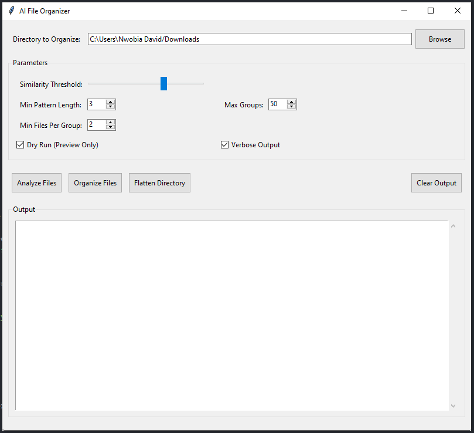
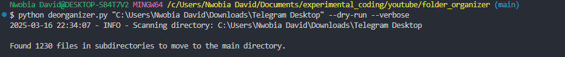

# AI File Organizer and Deorganizer

This project provides a graphical user interface (GUI) for organizing and deorganizing files in a directory. The tool helps users group files based on filename similarities and patterns, or flatten a directory structure by moving all files to the main directory.

### File Organizer (`script.py`)
- **Group files by similarity**: Automatically groups files based on filename similarities using a customizable similarity threshold.
- **Pattern-based grouping**: Identifies common patterns in filenames and groups files accordingly.
- **Dry run mode**: Preview file organization without making any changes.
- **Customizable parameters**: Adjust similarity threshold, minimum pattern length, maximum groups, and minimum files per group.
- **Verbose output**: Detailed logging for debugging and tracking file movements.
- **GUI interface**: User-friendly interface for selecting directories, configuring parameters, and viewing results.

### File Deorganizer (`deorganizer.py`)
- **Flatten directory structure**: Moves all files from subdirectories to the main directory.
- **Handle duplicates**: Automatically renames files to avoid overwriting.
- **Remove empty directories**: Cleans up empty directories after flattening.
- **Dry run mode**: Preview the flattening process without making any changes.
- **Verbose output**: Detailed logging for debugging and tracking file movements.

## Installation

1. **Clone the repository**:
   ```bash
   git clone https://github.com/NwobiaDavid/AI_FileOrganizer.git
   cd file-organizer
    ````

2. **Install dependencies**:
Ensure you have Python 3.7+ installed. Install the required packages using pip:
    ````bash
    Copy
    pip install -r requirements.txt
    ````

## Usage
### Running the File Organizer GUI
1. Navigate to the project directory:
    ```` bash
    cd file-organizer
    ````
2. Run the script.py file:
    ```` bash
    python script.py
    ````
3. Use the GUI to:
    -   Select the directory to organize.
    -   Configure parameters (similarity threshold, pattern length, etc.).
    -   Run a dry-run analysis or perform the actual organization.

### Running the File Deorganizer
1. Navigate to the project directory:
    ````bash
    cd file-organizer 
    ````
2. Run the deorganizer.py file with the desired directory:
    ````bash
    python deorganizer.py /path/to/directory --dry-run --verbose
    ````
    Replace `/path/to/directory` with the path to the directory you want to flatten. Use `--dry-run` to preview changes and `--verbose` for detailed output.

## Requirements
- Python 3.7+
- `tkinter` (usually included with Python)
- `tqdm` (for progress bars)
- `shutil`, `os`, `argparse`, `logging`, `re`, `collections`, `concurrent.futures`, `difflib` (standard Python libraries)

## Contributing
Contributions are welcome! Please open an issue or submit a pull request for any improvements or bug fixes.

## Screenshots

*File Organizer GUI*


*Deorganizer CLI Output*